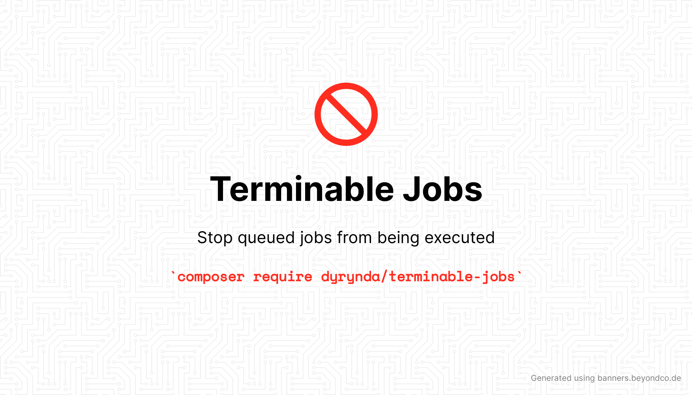

Terminable jobs is a small package that allows you to halt execution of queued Laravel jobs.

## Usage example

Lets say you have a queued jobs as follows:

```php
class PromotionalCampaign implements ShouldQueue
{
    use InteractsWithQueue, Queuable;

    public function __construct()
    {
        // ...
    }

    public function handle()
    {
        // ...
    }
}
```

Suppose that after queueing up thousands of jobs to email your promotional campaign to your users, you discover a typo or missing link to the promotion itself.

You may want to `queue:flush`, but if your jobs are on a shared queue, you would be flushing _all_ jobs on that queue, even if they're not the ones intended, which may lead to lost processing.

Enter Terminable Jobs.

```diff
+ use Dyrynda\TerminableJobs\Terminable;

class PromotionalCampaign implements ShouldQueue
{
-    use InteractsWithQueue, Queuable;
+    use InteractsWithQueue, Terminable, Queuable;

     public function handle()
     {
+        $this->handleTermination();
         // ...
     }
+
+    protected function shouldTerminate(): bool
+    {
+        // Logic to determine if job should be terminated
+    }
```

In the event that `shouldTerminate()` returns `true`, the `handleTermination()` method will delete the job from your queue and throw a `JobWasTerminated` exception, which will stop the job from being processed.

In it's simplest form, you could simply define a config variable in your application - controlled via the `.env` file - to toggle this on and off.

```php
// config/jobs.php
return [
    'promotional-campaign' => env('PROMOTIONAL_CAMPAIGN_ENABLED', true),
];
```

With this in place, you can update your `shouldTerminate()` method:

```diff
     protected function shouldTerminate(): bool
     {
+        return config('jobs.promotional-campaign') === false;
     }
```

This means that if you needed to halt the processing of your `PromotionalCampaign` job, you would then update the `PROMOTIONAL_CAMPAIGN_ENABLED` environment variable to `false` and restart your queue workers. Any pending jobs would then terminate early, throwing the `JobWasTerminated` exception.

To avoid extraneous reporting of exceptions to your log or bug tracking software, you may wish to add the `JobWasTerminated` class to your list of ignored exceptions:

```diff
// app/Exceptions/Handler.php
use Illuminate\Foundation\Exceptions\Handler as ExceptionHandler;
+ use Dyrynda\TerminableJobs\Exceptions\JobWasTerminated;

class Handler extends ExceptionHandler
{
     protected $dontReport = [
+        JobWasTerminated::class,
     ];
```

## Installation

`composer require dyrynda/terminal-jobs`

Once installed, you may use the `Terminable` trait in your job classes and implement the `shouldTerminate(): bool` method on your job class.

## Support

If you are having general issues with this package, feel free to contact me on [Twitter](https://twitter.com/michaeldyrynda).

If you believe you have found an issue, please report it using the [GitHub issue tracker](https://github.com/michaeldyrynda/terminable-jobs/issues), or better yet, fork the repository and submit a pull request.

If you're using this package, I'd love to hear your thoughts. Thanks!

## Treeware

You're free to use this package, but if it makes it to your production environment you are required to buy the world a tree.

It’s now common knowledge that one of the best tools to tackle the climate crisis and keep our temperatures from rising above 1.5C is to plant trees. If you support this package and contribute to the Treeware forest you’ll be creating employment for local families and restoring wildlife habitats.

You can buy trees [here](https://plant.treeware.earth/michaeldyrynda/terminable-jobs).

Read more about Treeware at [treeware.earth](https://treeware.earth)
